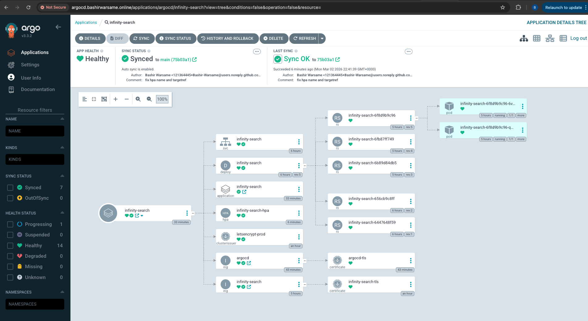

### GitOps-Based Kubernetes Deployment on AWS EKS

Infinity Search Solo is a **production-oriented GitOps deployment** of a containerized Flask application on **Amazon EKS**, designed to demonstrate **declarative Kubernetes operations, Git-driven delivery, and production networking patterns** using **Argo CD**.

The project intentionally emphasizes **runtime operations, deployment safety, and platform architecture**, rather than continuous integration implementation.


---

## Architecture Overview

The system is composed of the following components:

* Amazon EKS — managed Kubernetes control plane
* Argo CD — GitOps continuous delivery and reconciliation
* NGINX Ingress Controller — ingress traffic management
* cert-manager — automated TLS certificate lifecycle
* external-dns — DNS record automation
* Dockerized Flask application — application workload

### High-Level Deployment Flow

```text
Git Repository (Desired State)
        ↓
     Argo CD
        ↓
   Amazon EKS
        ↓
NGINX Ingress + TLS
        ↓
https://infinity-search.bashirwarsame.com
```

All cluster state is **declared in Git** and continuously reconciled into the running environment.

---

## GitOps Operating Model

This project follows a **GitOps-first operational model**, where Git acts as the **single source of truth** for application and infrastructure state.

### Key Characteristics

#### Declarative State

* Kubernetes manifests define the desired state
* No imperative changes are made directly to the cluster
* All changes are applied via Git commits

#### Audibility and Traceability

* Every change is version-controlled
* Git history provides a full audit trail
* Rollbacks are performed via Git reverts

#### Drift Detection

* Argo CD continuously compares live cluster state with Git
* Configuration drift is automatically detected and reported

This model significantly reduces operational risk and improves system predictability.

---

## Argo CD: Continuous Reconciliation

**Argo CD** serves as the control plane between Git and the Kubernetes cluster.



### Responsibilities

* Monitor Git repositories for desired state changes
* Reconcile Kubernetes resources continuously
* Detect and surface drift or unhealthy resources
* Provide visibility into application sync and health status

### Operational Benefits

* Cluster access is restricted to Argo CD
* Deployment logic is removed from CI systems
* Infrastructure changes are deterministic and repeatable

This aligns with **least-privilege access and defense-in-depth** principles.

---

## Platform Choice: Amazon EKS

**Amazon EKS** is used to provide a **production-grade Kubernetes control plane** without the operational overhead of self-managing Kubernetes masters.

### Benefits

* Managed, highly available control plane
* Native AWS IAM and networking integration
* Operational parity with enterprise Kubernetes environments
* Focus on workload operations rather than cluster maintenance

---

## Ingress, TLS, and DNS Automation

### NGINX Ingress Controller

* Centralized HTTP/HTTPS traffic routing
* Declarative ingress configuration via Kubernetes resources

### cert-manager

* Automated TLS certificate issuance and renewal
* Eliminates manual certificate management
* Enables HTTPS by default

### external-dns

* Automatically manages DNS records from Kubernetes state
* Ensures DNS reflects live ingress configuration
* Reduces manual DNS drift

Together, these components form a **fully automated edge and networking layer**.

---

## Continuous Delivery Scope

This project focuses on **continuous delivery via GitOps**, not continuous integration.

* Application images are assumed to be pre-built and available in a container registry
* Deployment updates occur by modifying Kubernetes manifests in Git
* Argo CD reconciles those changes into the cluster

This separation reflects common enterprise patterns where **CI and CD responsibilities are decoupled**.

---

## Design Principles Demonstrated

* Git as the single source of truth
* Declarative Kubernetes configuration
* Continuous reconciliation
* Immutable infrastructure patterns
* Least-privilege deployment access
* Automated ingress, TLS, and DNS

These principles align closely with **SRE and platform engineering best practices**.

---

## Project Intent

Infinity Search Solo is designed to demonstrate:

* Practical GitOps implementation using Argo CD
* Production-style Kubernetes operations on AWS
* Secure and automated ingress and networking
* Operational thinking beyond basic deployment tutorials

The project reflects **real-world patterns used by platform and SRE teams** operating Kubernetes in production.

---

## Potential Enhancements

Future improvements could include:

* CI pipelines for image build and registry publishing
* GitHub Actions with OIDC-based authentication
* Argo CD Image Updater
* Helm-based packaging
* Observability with Prometheus and Grafana
* Multi-environment GitOps (dev / staging / production)

---

## Summary

Infinity Search Solo demonstrates how **GitOps with Argo CD on Amazon EKS** enables:

* Predictable and auditable deployments
* Strong separation between build and runtime concerns
* Secure, declarative Kubernetes operations
* Scalable, production-ready application delivery

The architecture and practices shown in this project closely mirror how modern **enterprise and SRE teams deploy and operate Kubernetes workloads**.

